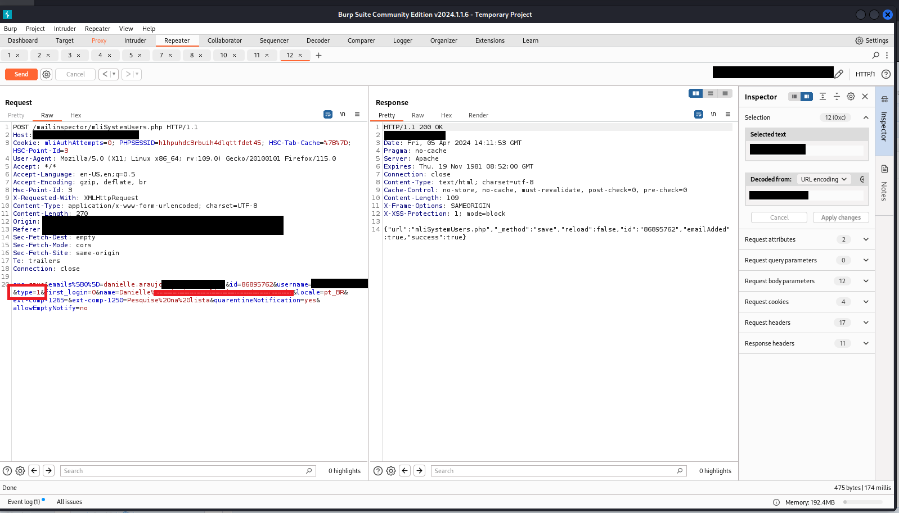

# CVE-2024-32371 Description

## Description
A vulnerability identified as CVE-2024-32371 allows an attacker to elevate privileges by changing the `type` parameter from 1 to 0. This vulnerability enables an attacker with a regular user account to escalate their privileges and gain administrative access to the system.

Versions: Discovered in HSC Mailinspector 5.2.17-3 but applicable to all versions up to 5.2.18.

## Vulnerable Parameter
- **Parameter:** `type`
- **Affected Values:** Changing the value from 1 (normal user) to 0 (administrator)

## Vulnerability Explanation
The vulnerability arises due to insufficient access control checks on the `type` parameter. By manipulating the value of the `type` parameter in the request payload, an attacker can modify their user account's permissions from a regular user to an administrator.

## Attack Scenario
To exploit this vulnerability, an attacker can intercept or craft a request with the `type` parameter set to 0, indicating administrator privileges. By submitting this malicious request, the attacker can bypass the intended access control mechanisms and gain unauthorized access as an administrator.

## Impact
Successful exploitation of CVE-2024-32371 allows an attacker to perform administrative actions within the system, such as:
- Accessing sensitive data or functionalities restricted to administrators.
- Modifying system configurations or user privileges.
- Performing malicious activities with elevated privileges, potentially leading to further compromise or data breaches.

